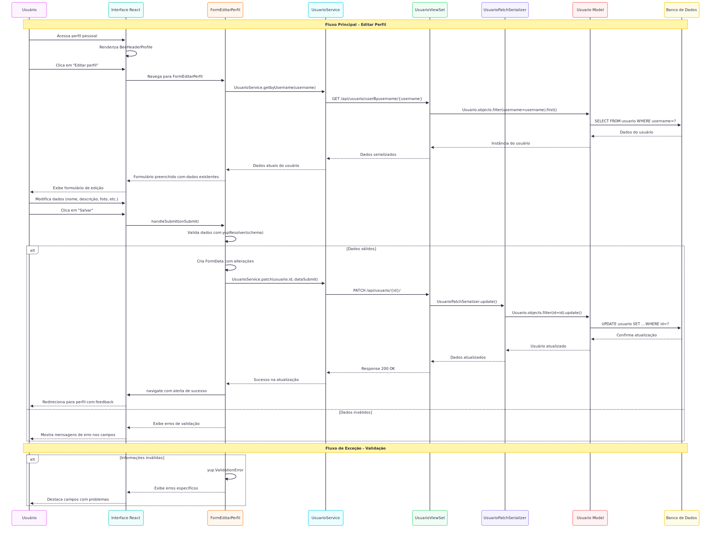

# CDU002.  Manuntenção  perfil pessoal

- **Ator principal**: Internauta e Moderador
- **Atores secundários**: ...	 
- **Resumo**: O usuário pode gerenciar suas informações, como editar os dados pessoais, atualizar a seção de educação e gerenciar conteúdos salvos.
- **Pré-condição**: O usuário deve estar autenticado no sistema.
- **Pós-Condição**: As informações do perfil do usuário são atualizadas no sistema e uma mensagem de feedback é exibida informando o sucesso ou erro na operação.

## Fluxo Principal - [Usuário muda as informações do seu perfil pessoa]
| Ações do ator | Ações do sistema |
| :-----------------: | :-----------------: | 
| 1. O usuário clica no botão "Editar Perfil", presente em seu perfil pessoal | ... | 
| ... | 2. O sistema exibe a tela de editar perfil ao usuário |
| 3. O usuário faz as alterações desejadas e clica no botão "salvar alterações" | ... | 
| ... | 4. O sistema valida as alterações feitas e exibe feedback informando o sucesso ou erro na operação. |

## Fluxo Alternativo I - [Não há fluxo alternativo para esse CDU]

## Fluxo exceção - [Informações inválidas]
| Ações do ator | Ações do sistema |
| :-----------------: | :-----------------: | 
| 1. O usuário acessa seu perfil pessoal. | ... | 
| ... | 2. O sistema mostra a tela de perfil pessoal ao usuário. |
| 3. O usuário clica no botão 'Editar Perfil', localizado na seção de configurações. | ... | 
| ... | 4. O sistema exibe a tela de editar perfil ao usuário. |
| 5. O usuário faz as alterações desejadas, porém insere informações inválidas. | ... |
| ... | 6. O sistema impede que a ação seja finalizada, informando que tem algum erro e solicita a correção para que a ação seja finalizada. |

## Protótipo

> 💡 Os diagramas abaixo estão em formato SVG (vetorial), o que permite ampliar sem perder qualidade.  
> Por terem fundo transparente, podem ficar pouco visíveis no modo escuro do GitHub.  
> Recomendamos baixá-los para melhor visualização.

## Diagrama de Interação (Sequência ou Comunicação)

## Diagrama de Classes de Projeto

