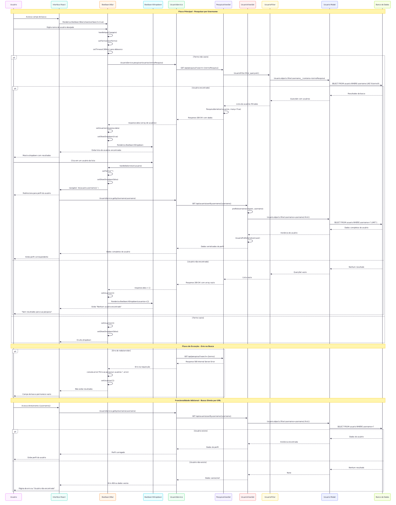

# CDU003. Pesquisar Usuário

- **Ator principal**: Visitante, Internauta e Moderador
- **Atores secundários**: ...	 
- **Resumo**: O usuário pode pesquisar perfis de outros usuários da rede social utilizando o nome de usuário (username) inserido no campo de busca.
- **Pré-condição**: Não há.
- **Pós-Condição**: O sistema exibe o perfil correspondente ao nome de usuário pesquisado ou uma mensagem de erro caso nenhum usuário seja encontrado.

## Fluxo Principal
| Ações do ator | Ações do sistema |
| :-----------------: | :-----------------: | 
| 1 -  O usuário acessa o campo de pesquisa(search bar) na interface e preenche com o nome de usuário que deseja pesquisar. ||  
|| 2 - O sistema processa a solicitação e exibe o perfil correspondente ao nome de usuário pesquisado, caso exista.| 

## Fluxo Alternativo I - Não há

## Fluxo de Exceção I - [Nome de usuário não encontrado]
| Ações do ator | Ações do sistema |
| :-----------------: | :-----------------: | 
| 1 - O usuário acessa o campo de pesquisa na interface e preenche com o nome de usuário desejado.|| 
|| 2 - O sistema processa a solicitação, mas não encontra nenhum perfil correspondente. Então, exibe a mensagem: “Sem resultados para sua pesquisa”|  

## Protótipo

> 💡 Os diagramas abaixo estão em formato SVG (vetorial), o que permite ampliar sem perder qualidade.  
> Por terem fundo transparente, podem ficar pouco visíveis no modo escuro do GitHub.  
> Recomendamos baixá-los para melhor visualização.

## Diagrama de Interação (Sequência ou Comunicação)

## Diagrama de Classes de Projeto

