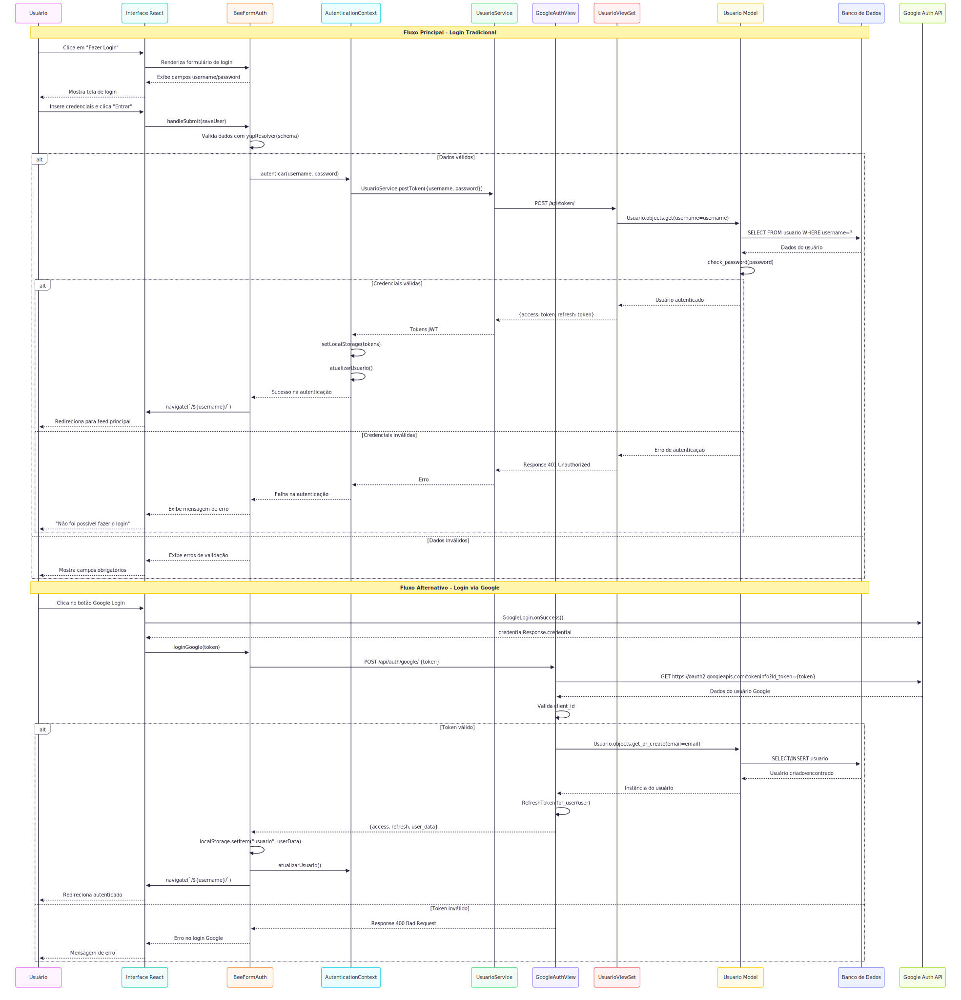

# CDU004. Fazer Login

- **Ator principal**: Internauta e moderador
- **Atores secundários**: ...
- **Resumo**: Permite que os usuários façam login utilizando e-mail ou nome de usuário e senha. Uma vez autenticados, têm acesso a funcionalidades exclusivas do sistema, de acordo com seu perfil (internauta ou moderador).
- **Pré-condição**: O usuário não deve estar autenticado no sistema.
- **Pós-Condição**: O sistema retorna feedback de sucesso ou erro após a tentativa de login. Se a autenticação for bem-sucedida, o usuário é autenticado e passa a ter acesso às funcionalidades restritas do sistema.

## Fluxo Principal - [Fazer Login]
| Ações do ator | Ações do sistema |
| :-----------------: | :-----------------: |
| 1 - Clica no botão "Fazer login". | |
|  | 2 - Exibe a página de login. |
| 3 - Insere credenciais (e-mail ou nome de usuário e senha) e clica no botão "Entrar". |  |
|  | 4 - Valida as credenciais, autentica o usuário e redireciona ao feed principal.|

## Fluxo Alternativo - [Login com Conta Externa(Google)] 
| Ações do ator | Ações do sistema |
| :-----------------: |:-----------------: |
| 1 - Clica no botão "Fazer login". | |
|  | 2 - Exibe a página de login. |
| 3 - Clica no botão para login via Google. | |
| | 4 - Redireciona para a autenticação externa. |
| 5 - Concede permissão para acessar os dados básicos da conta. | |
| | 6 - Recebe o token e autentica o usuário no sistema, redirecionando ao feed principal. |

## Fluxo de Exceção - [Credenciais Inválidas]
| Ações do ator | Ações do sistema |
| :-----------------: | :-----------------: |
| 1 - Clica no botão "Fazer login". | |
|  | 2 - Exibe a página de login. |
| 3 - O Usuário insere as credenciais incorretas e clica no botão "Entrar". | |
| | 2 - Valida as credenciais e identifica que são inválidas, o sistema exibe uma mensagem de erro. |

## Protótipo

> 💡 Os diagramas abaixo estão em formato SVG (vetorial), o que permite ampliar sem perder qualidade.  
> Por terem fundo transparente, podem ficar pouco visíveis no modo escuro do GitHub.  
> Recomendamos baixá-los para melhor visualização.

## Diagrama de Interação (Sequência ou Comunicação)

## Diagrama de Classes de Projeto

