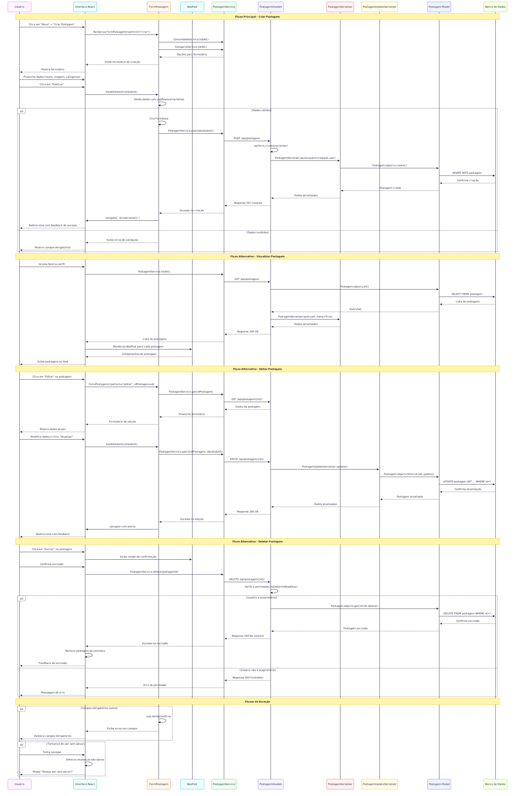

# CDU005. Manter Postagem

- **Ator principal**: Internauta e moderador
- **Atores secundários**: ...
- **Resumo**: Permite ao usuário criar, visualizar, editar e deletar postagens pessoais, bem como visualizar postagens de outros usuários na comunidade.
- **Pré-condição**: O usuário deve estar autenticado no sistema.
- **Pós-condição**: O sistema exibe feedback de sucesso ou erro além de resgistrar alterações no banco a cada mudança/ação do usuário.

## Fluxo Principal - [Criar Postagem]

| **Ações do ator**                                                          | **Ações do sistema**                        |
| -------------------------------------------------------------------------- | ------------------------------------------- |
| <a href="https://github.com/user-attachments/assets/9467cf41-03cc-4223-b03e-af6b274bb9d3"> 1. Usuário clica no botão “Novo” e seleciona opção "criar postagem" em seu perfil pessoal.</a>                                         |                                             |
|                                                                            | 2. Sistema exibe formulário de criação de postagem. |
| <a href="https://github.com/user-attachments/assets/21c7674e-4506-47c6-8c88-cd3b9eb8cd4c"> 3. Preenche informações obrigatórias e clica em “Enviar”. </a> |                                             |
|                                                                            | 4. Mostra mensagem de sucesso.              |
| 5. Exibe perfil do usuário com a nova postagem sendo exibida               |                                             |

## Fluxo Alternativo - [Visualizar Postagem Perfil Pessoal]

| **Ações do ator**                | **Ações do sistema**                    |
| -------------------------------- | --------------------------------------- |
| 1. Acessa a área de "Postagens" no perfil pessoal. |                       |
|                                  | 2. Exibe lista de postagens do usuário. |

## Fluxo Alternativo - [Visualizar Postagem Feed]

| **Ações do ator**                | **Ações do sistema**                    |
| -------------------------------- | --------------------------------------- |
| 1. Abre página de feed(página inicial). |                       |
|                                  | 2. Exibe lista de postagens mais recentes dos usuários e comunidades que aquele perfil segue. |

## Fluxo Alternativo - [Editar Postagem]

| **Ações do ator**                                                   | **Ações do sistema**                                           |
| ------------------------------------------------------------------- | -------------------------------------------------------------- |
| 1. Visualiza postagem feita por ele mesmo |                                                                 |
|                                                                     | 2. Exibe opções ao clicar nos três pontos ao lado da postagem. |
| 3. Seleciona “Editar postagem”.                                     |                                                                |
|                                                                     | <a href="https://github.com/user-attachments/assets/b5cadf75-91b2-4dc9-978f-acb553ba7fe5"> 4. Exibe formulário de edição com campos preenchidos. </a> |
| 5. Realiza alterações e salva.                                      |                                                                |
|                                                                     | 6. Exibe uma mensagem de sucesso.                              |
| 7. Atualiza a postagem e redireciona para o perfil pessoal.         |                                                                |

## Fluxo Alternativo - [Deletar Postagem]

| **Ações do ator**                                                          | **Ações do sistema**                                           |
| -------------------------------------------------------------------------- | -------------------------------------------------------------- |
| 1. Visualiza postagem própria que deseja deletar.  |                                                                |
|                                                                            | 2. Exibe opções ao clicar nos três pontos ao lado da postagem. |
| 3. Seleciona “Deletar”.                                                    |                                                                |
|                                                                            | 4. Exibe pop-up de confirmação de deleção.                     |
| 5. Confirma a ação.                                                        |                                                                |
|                                                                            | 6. Exibe mensagem de sucesso                                   |
| 7. Remove a postagem e redireciona para o perfil pessoal.                  |                                                                |

## Fluxo Alternativo - [Visualizar Postagem de Outros Usuários]

| **Ações do ator**                | **Ações do sistema**                                            |
| -------------------------------- | --------------------------------------------------------------- |
| 1. Navega pela página principal. |                                                                 |
|                                  | 2. Clica no nome do usuário para acessar o seu perfil.          |
| 3. Clica na área de postagens.   |                                                                 |
|                                  | 4. Exibe postagens de outro usuário organizadas por cronologia. |

## Fluxo de Exceção - [Criar/Editar Postagem]

| **Ações do ator**                                             | **Ações do sistema**                                                         |
| ------------------------------------------------------------- | ---------------------------------------------------------------------------- |
| 1. Tenta enviar formulário sem preencher campos obrigatórios. |                                                                              |
|                                                               | 2. Exibe mensagem de erro solicitando preenchimento dos campos obrigatórios. |

## Fluxo de Exceção - [Editar Postagem]

| **Ações do ator**                              | **Ações do sistema**                                           |
| ---------------------------------------------- | -------------------------------------------------------------- |
| 1. Realiza alterações e tenta sair sem salvar. |                                                                |
|                                                | 2. Exibe aviso de confirmação para sair sem salvar alterações. |

## Protótipo

## Diagrama de atividades 

> 💡 Os diagramas abaixo estão em formato SVG (vetorial), o que permite ampliar sem perder qualidade.  
> Por terem fundo transparente, podem ficar pouco visíveis no modo escuro do GitHub.  
> Recomendamos baixá-los para melhor visualização.

## Diagrama de Interação (Sequência ou Comunicação)

## Diagrama de Classes de Projeto

