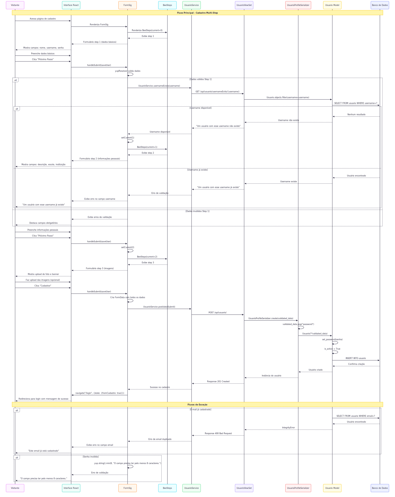

# CDU006. Fazer cadastro

- **Ator principal**: Visitante
- **Atores secundários**: ...	 
- **Resumo**: O caso de uso permite que o usuário possa fazer o cadastro no sistema, fornecendo dados como: nome de usuário, email, senha, escolhendo quais comunidades são de seu interesse e inserindo suas informações no seu perfil pessoal.
- **Pré-condição**: O usuário não pode estar autenticado no sistema.
- **Pós-Condição**: Após o cadastro o sistema valida os dados e armazena as informações no banco de dados, concluindo assim, com sucesso o cadastro e o usuário estará habilitado para acessar o conteúdo das comunidades selecionadas na etapa de cadastro.

## Fluxo Basico - [ Fazer cadastro ]
| Ações do ator (usuario) | Ações do sistema |
| :-----------------: | :-----------------: | 
| 1. O usuário acessa a página de fazer cadastro |  |  
| | 2. O sistema exibe o formulário de cadastro solicitando: nome de usuário, email, senha, seleção de comunidades e inserção de informações no perfil pessoal. |  
| 3. O usuário preenche os campos solicitados e confirma o cadastro. | | 
|| 4. O sistema valida os dados fornecidos, e os dados são armazenados no banco de dados, após isso o sistema exibe uma mensagem confirmando o sucesso do cadastro. | 

## Fluxo Alternativo I - [ E-mail já cadastrado ]
| Ações do ator | Ações do sistema |
| :-----------------: | :-----------------: | 
| 1. O usuário acessa a página de fazer cadastro |  |  
| | 2. O sistema exibe o formulário de cadastro solicitando: nome de usuário, email, senha, seleção de comunidades e inserção de informações no perfil pessoal. |  
| 3. O usuário preenche os campos solicitados e confirma o cadastro. | | 
|| 4. O sistema detecta que o e-mail já está registrado e exibe uma mensagem informando que o e-mail já está cadastrado.| 

## Fluxo de exceção - [ Senha inválida ]
| Ações do ator | Ações do sistema |
| :-----------------: | :-----------------: | 
| 1. O usuário acessa a página de fazer cadastro |  |  
| | 2. O sistema exibe o formulário de cadastro solicitando: nome de usuário, email, senha, seleção de comunidades e inserção de informações no perfil pessoal. |  
| 3. O usuário preenche os campos solicitados e confirma o cadastro. | | 
|| 4. O sistema detecta que a senha não atende aos critérios mínimos, e exibe uma mensagem indicando os possíveis erros (credenciais inválidas ou senha não corresponde).| 

**Protótipos**

> 💡 Os diagramas abaixo estão em formato SVG (vetorial), o que permite ampliar sem perder qualidade.  
> Por terem fundo transparente, podem ficar pouco visíveis no modo escuro do GitHub.  
> Recomendamos baixá-los para melhor visualização.

## Diagrama de Interação (Sequência ou Comunicação)

## Diagrama de Classes de Projeto

