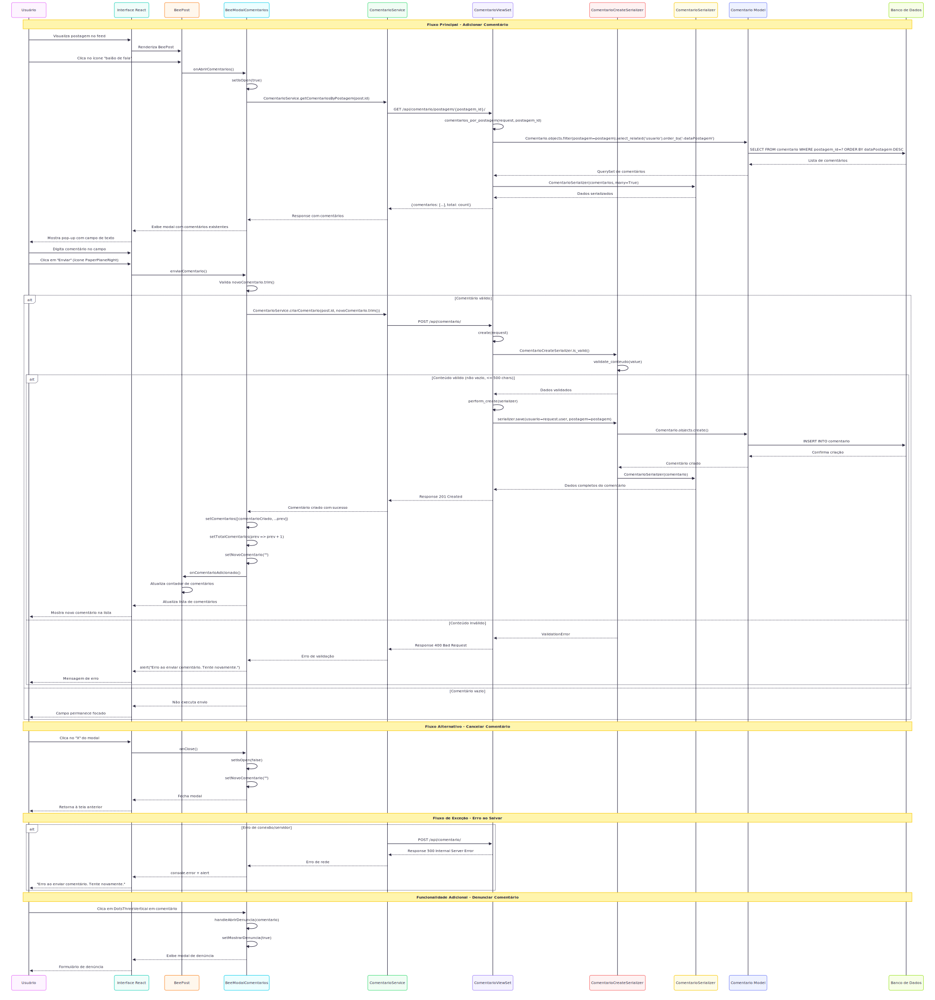

# CDU007. Comentar postagem 

- **Ator principal**: Internauta e moderador
- **Atores secundários**: ...	 
- **Resumo**: O usuário pode adicionar um comentário ao clicar no ícone de "balão de fala" em uma postagem já existente na plataforma.
- **Pré-condição**: 
1.  O usuário deve estar autenticado no sistema.

- **Pós-Condição**: 
1. O comentário será registrado no post correspondente, associado ao usuário que o realizou.
2. Feedback positivo ou negativo será fornecido ao usuário em caso de sucesso ou erro.

## Fluxo Principal [Comentar em uma postagem]
| Ações do ator | Ações do sistema |
| :-----------------: | :-----------------: | 
| 1. O usuário clica no ícone de “Balão de fala” para fazer um comentario na postagem. | ... | 
| ... | 2. O sistema exibe o pop-up para que o usuário realize o comentario. |
| 3. O usuário digita sua mensagem no campo de texto fornecido e confirma o envio do comentário clicando no botão “Enviar”. | ... |
| ... | 4. O sistema salva o comentário no banco de dados, associando-o ao post e ao usuário e atualiza a lista de comentários exibida, incluindo o novo comentário.|

## Fluxo Alternativo  [Cancelar comentário] 
| Ações do ator | Ações do sistema |
| :-----------------: |:-----------------: | 
| 1. O usuário clica no ícone de “Balão de fala” para fazer um comentario na postagem. | ... | 
| ... | 2. O sistema exibe o pop-up para que o usuário realize o comentario. |
| 3. O usuário começa a digitar mas desiste de fazer o comentário, e cancela a ação clicando no icone de "X" para fechar o pop up|  ... |
| ... | 4. O sistema descarta o comentário digitado sem salvá-lo e feicha o pop up retornando o usuário à tela anterior. |

## Fluxo de exceção [Erro ao salvar comentário]
| Ações do ator | Ações do sistema |
| :-----------------: | :-----------------: | 
| 1. O usuário clica no ícone de “Balão de fala” para fazer um comentario na postagem. | ... | 
| ... | 2. O sistema exibe o pop-up para que o usuário realize o comentario. |
| 3. O usuário digita seu comentario e clica no botão “Enviar”. | ... |  
| ... | 4. O sistema tenta salvar o comentário, mas ocorre uma falha (ex.: problemas de conexão ou erro no servidor), é exibido uma mensagem de erro ao usuário informando que o comentário não pôde ser salvo, o comentário é descartado. | 

## Protótipo 

> 💡 Os diagramas abaixo estão em formato SVG (vetorial), o que permite ampliar sem perder qualidade.  
> Por terem fundo transparente, podem ficar pouco visíveis no modo escuro do GitHub.  
> Recomendamos baixá-los para melhor visualização.

## Diagrama de Interação (Sequência ou Comunicação)

## Diagrama de Classes de Projeto

