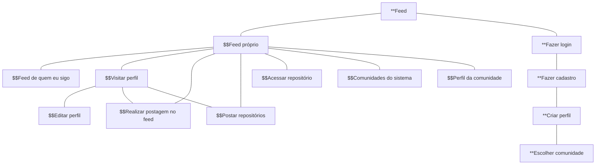

# Protótipos de Interface com o Usuário

## Mapa do Site

> Legenda:
- $$ (Usuário autenticado)
- ** (Usuário não autenticado)

## A. Tela 1: Feed 

## B. Tela 2: Login/cadastro

## C. Tela 3: Publicar repositórios

## D. Tela 4: Publicar postagem

## E. Tela 5: Acessar repositório

## F. Tela 6: Perfil da comunidade

## G. Tela 7: Editar perfil

