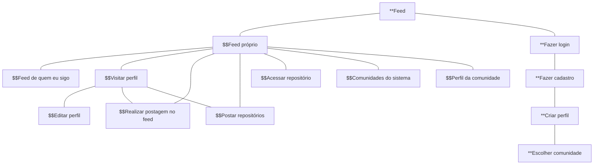

# Protótipos de Interface com o Usuário

## Mapa do Site

> Legenda:
- $$ (Usuário autenticado)
- ** (Usuário não autenticado)

## A. Tela 1: Feed 
## B. Tela 2: Login/cadastro
## C. Tela 3: Feed próprio 
## D. Tela 4: Feed de quem eu sigo
## E. Tela 5: Realizar postagem no feed
## F. Tela 6: Postar repositórios
## G. Tela 7: Acessar repositório
## H. Tela 8: Comunidades do sistema
## I. Tela 9: Perfil da comunidade
## J. Tela 10: Editar perfil
